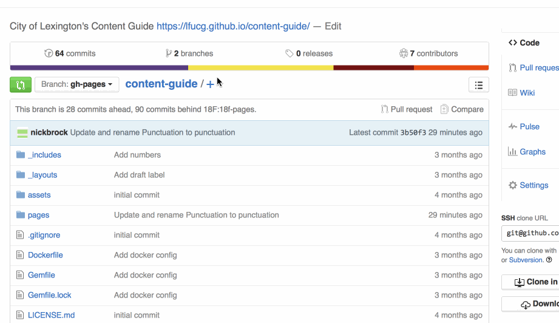
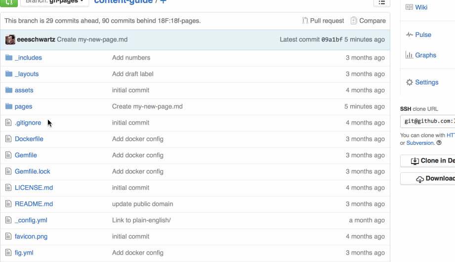

## Ciy of Lexington Content Guide

This guide helps writers create content that’s easy to use and meets citizens where they’re at. Government websites often talk at readers rather than to them: As with other facets of its online presence, .gov writing tends to describe the government’s concerns in “governmentese,” leaving users frustrated by information that is neither actionable nor understandable.

This guide takes into account that frustration as well as several commonly supported guidelines about writing for the web. Using this guide can help content designers benefit from our experience to date, incorporate user feedback into the content design process, and engender trust by communicating in a consistent manner.

## How to use this guide

We created this guide for reference on an as-needed basis. It’s here when you’re wondering whether to capitalize the word federal, for instance, or when you’re wondering how to create a friendly, informational tone.

To this end, we’ve structured the guide into descriptively named sections. Browse our table of contents to find the topic you’re looking for.

We aren’t opposed if you’d like to read this guide start to finish, of course.

Most importantly, we encourage you to make a copy of this document and adapt its to your organizational needs. This guide is just that: a guide. It’s not meant to provide the final opinion on any of the topics discussed. If a certain section isn’t relevant to you and your team, delete it. And if you feel the guide is missing a section, by all means, add it. This guide is yours to use, and we trust you’ll update it in the ways that best suit you.

## How to add a page

### 1. Create a [new file](https://github.com/lfucg/content-guide/new/gh-pages/pages) in the pages directory.
### 2. Add the content template:

```
---
permalink: my-new-permalink/
layout: default
title: My new page
---

Content here!
```


 
### 3. Edit [_config.yml](https://github.com/lfucg/content-guide/edit/gh-pages/_config.yml)
### 4. Add the new page to the `navigation` section:

```
Navigation:
- text: My new page
  url: my-new-permalink/
  internal: true
```




### Public domain

This project is in the worldwide [public domain](LICENSE.md).

> As a work of the United States Government, this project is in the public domain within the United States.

>Additionally, we waive copyright and related rights in the work worldwide through the CC0 1.0 Universal public domain dedication.
